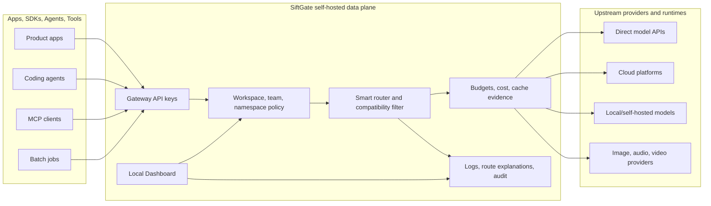
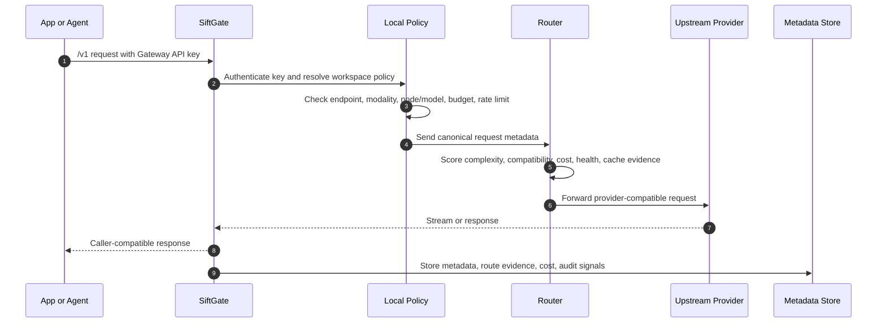

<p align="center">
  
</p>

<h3 align="center">Self-hosted AI Gateway infrastructure for teams, agents, and multi-provider applications.</h3>

<p align="center">
  <a href="https://github.com/seanbabalala/ai-gateway/releases"></a>
  <a href="LICENSE"></a>
  <a href="docs/SECURITY.md"></a>
  <a href="docs/README.md"></a>
</p>

<p align="center">
  <a href="docs/i18n/en/README.md">English</a>
  · <a href="docs/i18n/zh/README.md">简体中文</a>
  · <a href="docs/i18n/zh-TW/README.md">繁體中文</a>
  · <a href="docs/i18n/ja/README.md">日本語</a>
  · <a href="docs/i18n/ko/README.md">한국어</a>
  · <a href="docs/i18n/th/README.md">ไทย</a>
  · <a href="docs/i18n/es/README.md">Español</a>
</p>

# SiftGate

Current release: **v2.8.4**.

SiftGate is an MIT open-source AI Gateway that gives organizations one
self-hosted control point for model traffic, agent traffic, provider
credentials, routing policy, cost governance, and operational evidence. It sits
between applications, coding agents, SDKs, MCP tools, and upstream AI providers,
then applies local policy before a request leaves your infrastructure.

It supports OpenAI-compatible, Anthropic-compatible, Batch, Realtime preview,
media, embedding, rerank, and MCP tool traffic while keeping provider keys,
runtime policy, and sensitive operational metadata inside the self-hosted data
plane by default.

## Why SiftGate Exists

AI adoption usually starts with a few direct provider keys. It quickly becomes
a platform problem:

| Challenge | What SiftGate adds |
| --- | --- |
| Provider sprawl | One gateway for OpenAI, Anthropic, Google, Azure, Bedrock, OpenRouter, local runtimes, media providers, speech providers, and custom OpenAI-compatible endpoints. |
| Agent sprawl | Govern Cursor, Cline, Roo Code, Continue, Codex, Claude Code, OpenCode, chatbot clients, and MCP tool calls through one local ingress. |
| Unclear routing | Explain why a node or model was selected, skipped, filtered, retried, or downgraded without storing prompt or response bodies by default. |
| Cost surprises | Enforce daily budgets, token and cost limits, provider-cache savings, price-source governance, chargeback reports, and anomaly evidence. |
| Key exposure | Keep provider API keys in local config, environment variables, or secret references; issue separate Gateway API keys to apps and agents. |
| Production readiness | Move from local memory and SQLite to PostgreSQL, Redis, Docker, Kubernetes, Helm, OIDC, log sinks, and secret backends when needed. |

## System At A Glance



The open-source data plane is complete on its own. A future or external control
plane is optional; AI requests do not need to pass through a hosted service.

## Capability Map

| Area | Capabilities |
| --- | --- |
| AI ingress | Chat Completions, Responses, Anthropic Messages, Embeddings, Rerank, Images, Audio, Video preview, Batch API, Realtime preview, Models, Feedback, and MCP Tool Gateway traffic. |
| Protocol translation | Canonical request model, protocol-aware normalizers and denormalizers, structured-output preservation, reasoning/thinking intent metadata, streaming support, multipart media pass-through, async job metadata. |
| Routing | `model: "auto"`, direct model routing, aliases, node shortcuts, model-family prefixes, tiered routing, fallback chains, split testing, compatibility-profile filtering, circuit breakers, momentum, load balancing, cache-aware cost routing. |
| Governance | Workspaces, local Dashboard RBAC, Gateway API keys, teams, Policy Namespaces, allowed endpoints, allowed modalities, allowed nodes, allowed models, per-key/team/namespace/global budgets, rate limits, audit events. |
| Provider operations | Provider Catalog, Add Node Wizard, 50+ provider metadata coverage, active vs transport-only visibility, pricing-source governance, custom provider templates, custom-header auth, provider health dashboard, config validation. |
| Agent operations | Coding Agent Gateway profiles, profile-scoped virtual models, connector templates, metadata-only coding-agent sessions, Agent Platform preview, MCP server allow-lists and tool-call proxying. |
| Observability | Dashboard analytics, call logs, route decision traces, session timelines, provider health, benchmarks, cache savings, export-safe metadata, webhook alerts, optional log sinks, OpenTelemetry metrics/traces. |
| Cost and quality | Daily budget enforcement, estimated spend, provider-cache savings, chargeback reports, anomaly detection, route feedback, Intelligence Loop token prediction, optional cost optimizer, optional quality gate, async eval metadata. |
| Semantic controls | Semantic Cache v2, Prompt Registry metadata, Context Window Optimizer evidence, Intent Classification, Guardrails v2 metadata, workspace/API key/model isolation by default. |
| Deployment | Local development, Docker Compose, Docker image path, Kubernetes manifests, Helm chart, SQLite default, PostgreSQL production path, optional Redis shared state, OIDC, secret references. |

## Competitive Matrix

SiftGate is not trying to be only a cheap model router or only an API resale
panel. It is designed as an AI traffic data plane: provider-compatible ingress,
policy, routing, budget control, agent governance, route evidence, and
production operations in one self-hosted system.

Public positioning references: [Manifest](https://github.com/mnfst/manifest),
[One API](https://github.com/songquanpeng/one-api), and
[New API](https://github.com/QuantumNous/new-api).

| Capability | SiftGate | Manifest | One API | New API |
| --- | --- | --- | --- | --- |
| Primary product stance | Self-hosted AI traffic data plane for teams, agents, and multi-provider production operations | Smart model router for agents and apps, with cost reduction as the headline | LLM API management and key redistribution system | AI model hub for aggregation, distribution, format conversion, and billing |
| Best fit | Teams that need BYOK governance, routing, observability, budgets, agents, MCP, and production controls in one gateway | Personal or agent-heavy workflows that want cheap automatic routing quickly | Multi-provider API distribution with users, tokens, channels, and quota management | Larger aggregation/distribution deployments that need UI, channel management, billing, and protocol conversion |
| OpenAI-compatible ingress | Yes | Yes | Yes | Yes |
| Anthropic Messages-compatible ingress | Yes | Not primary | Partial / adapter-dependent | Yes |
| OpenAI Responses support | Yes | Not primary | Not primary | Version/provider dependent |
| Realtime, Batch, Images, Audio, Video | Yes, with explicit endpoint families and preview flags where appropriate | Limited / not primary | Provider/channel dependent | Broad protocol coverage; exact endpoint coverage depends on deployment/version |
| MCP Tool Gateway | Built in: Gateway API key auth, namespace allow-lists, rate limits, metadata-only calls | Not primary | Not primary | Skills/app integrations exist; MCP gatewaying is not the core surface |
| Coding-agent governance | Cursor, Cline, Roo Code, Continue, Codex, Claude Code, OpenCode, Generic OpenAI, Generic Anthropic profiles with virtual smart models | Strong agent focus, optimized for cost-aware routing | Generic API token/channel model | AI editor skills and app integrations, plus token/model management |
| Smart routing | Complexity scoring, compatibility profiles, cache-aware cost routing, circuit state, fallback chains, split rules, route traces | Core strength: local scoring and cheapest-capable-model routing | Channel priority/weight/load balancing | Channel weighting, failover, and protocol conversion |
| Explainable route evidence | First-class Route Explanation with selected/rejected candidates, policy filters, cost, latency, compatibility, reasoning, fallback, and cache evidence | Cost and model metadata focus | Basic logs/quota/channel evidence | Logs, dashboards, quota and channel evidence |
| Policy hierarchy | Workspace -> API key -> Team -> Policy Namespace -> endpoint/modality/node/model restrictions | Budgets, limits, agents, providers | Users, tokens, channels, quotas | Users, groups, tokens, channels, quotas, billing |
| Budget model | Global, Policy Namespace, Team, and API Key daily token/cost scopes with explicit source-of-truth handling | Spend limits and tracking | Quota and token accounting | Granular billing, recharge/subscription-style quota controls |
| Provider catalog governance | 50+ provider metadata, compatibility profiles, active vs transport-only visibility, price-source status, override precedence, config validation | 500+ model-oriented routing catalog | Provider/channel management | Provider/channel management and model assets |
| Privacy default | Metadata-only by default; no prompt/response/raw header/provider key/tool payload/media/source/diff storage by default | Public docs state prompt/response are not stored by default | Deployment/operator dependent | Deployment/operator dependent |
| Production path | SQLite local default, PostgreSQL production path, optional Redis shared state, Docker, Kubernetes, Helm, OIDC, secret references, log sinks, OpenTelemetry | Docker-focused self-hosting plus cloud option | Single binary and Docker-ready | Docker, database options, admin UI, multi-tenant operations |
| Public repo differentiation | AI traffic governance and observability layer, not a resale wallet or simple router | Excellent cost-first routing story | Mature distribution/key management pattern | Feature-rich distribution and billing hub |

Read the fuller comparison in [docs/COMPARISON.md](docs/COMPARISON.md).

## Request Flow



By default, SiftGate stores operational metadata such as request ids, selected
node/model, latency, status, token usage, cost estimate, policy labels,
fallback reason, cache evidence, and route explanation. It does **not** store
prompts, responses, raw provider headers, provider keys, tool payloads, media
bytes, hidden reasoning text, or resolved secrets unless a specific feature is
explicitly configured to retain content.

## Gateway API Surface

SiftGate exposes provider-compatible endpoints so existing clients can move
behind the gateway with minimal changes.

| Endpoint | Purpose |
| --- | --- |
| `POST /v1/chat/completions` | OpenAI Chat Completions-compatible ingress |
| `POST /v1/responses` | OpenAI Responses-compatible ingress |
| `POST /v1/messages` | Anthropic Messages-compatible ingress |
| `POST /v1/embeddings` | Embedding routing |
| `POST /v1/rerank` | Rerank routing |
| `POST /v1/images/generations` | Image generation |
| `POST /v1/images/edits` | Image edits with JSON or multipart pass-through |
| `POST /v1/images/variations` | Image variations |
| `POST /v1/audio/transcriptions` | Audio transcription |
| `POST /v1/audio/translations` | Audio translation |
| `POST /v1/audio/speech` | Text-to-speech |
| `POST /v1/videos/generations` | Experimental async video generation preview |
| `POST /v1/batches` | OpenAI-compatible Batch API proxy |
| `WS /v1/realtime` | Experimental Realtime pass-through, disabled by default |
| `GET /v1/models` | OpenAI-compatible model list and gateway aliases |
| `POST /v1/feedback` | Metadata-only route feedback |

Interactive OpenAPI documentation is available at `GET /docs` when the gateway
is running.

## Dashboard Surfaces

The Dashboard runs from the same gateway process and is part of the open-source
data plane.

| Page | What operators use it for |
| --- | --- |
| Overview | First-run setup, live traffic, cost, cache savings, provider health, recent activity, and Intelligence Loop summary. |
| Nodes | Configure upstream provider nodes, run safe checks, inspect health, circuits, compatibility, and pricing warnings. |
| Provider Catalog | Explore provider/model metadata, recommended defaults, modality coverage, compatibility profiles, and pricing source status. |
| Routing | Edit tiers, targets, fallback chains, load balancing, split rules, and recommendations. |
| Route Explanation | Inspect selected and rejected candidates, policy filters, cost/latency/context tradeoffs, compatibility evidence, and fallback reasons. |
| Logs and Sessions | Review request metadata, source format, route result, cache outcome, structured-output and reasoning intent, agent sessions, and export-safe details. |
| API Keys | Create, rotate, disable, scope, and audit client-facing Gateway API keys. |
| Workspaces and Members | Manage local Workspaces, fixed OSS roles, membership, and invitations. |
| Policy Namespaces and Budget | Configure shared policy labels, source-of-truth budget scopes, limits, and resets. |
| Agents | Render safe connector profiles for coding agents and inspect metadata-only agent sessions. |
| MCP Tool Gateway | Proxy MCP server calls behind Gateway API key auth and namespace allow-lists. |
| Semantic Controls | Operate semantic cache metadata, prompt registry metadata, intent counts, context evidence, and guardrails findings. |
| Cost Platform | Review chargeback reports, anomalies, provider price governance, and feedback aggregation. |
| Eval, Shadow, Experiments | Keep eval reports, shadow traffic, and A/B split analytics separate and inspectable. |
| Audit and Config Audit | Review redacted management events, config versions, validation-first rollback, and hash-chain evidence. |

## Provider And Model Ecosystem

SiftGate is designed for heterogeneous provider environments. The built-in
catalog includes direct model APIs, China providers, aggregators, cloud
platforms, media providers, speech/audio providers, local runtimes, and
OpenAI-compatible hosted inference providers.

| Family | Examples |
| --- | --- |
| Direct model APIs | OpenAI, Anthropic, Google Gemini / Vertex, Mistral, DeepSeek, xAI, Cohere, AI21 Labs |
| China providers | Qwen / DashScope, Baidu Qianfan, Volcengine Ark / Doubao, Zhipu GLM, Moonshot / Kimi, MiniMax, Tencent Hunyuan, 01.AI |
| Aggregators | OpenRouter, Hugging Face Inference Providers, Replicate, Together AI, Fireworks AI, NVIDIA NIM, GitHub Models |
| Cloud platforms | AWS Bedrock, Azure OpenAI, Cloudflare Workers AI, IBM watsonx.ai, Databricks Mosaic AI |
| Media generation | fal.ai, Stability AI, Black Forest Labs, Ideogram, Luma AI, Runway, Pika |
| Speech, audio, embedding, rerank | ElevenLabs, Deepgram, AssemblyAI, Cartesia, Speechmatics, Voyage AI, Jina AI |
| Local and self-hosted | Ollama, vLLM, LM Studio, llama.cpp server, TGI, SGLang, Xinference, Baseten, Lepton AI, Modal, RunPod, Predibase, Lamini |
| Hosted compatible inference | DeepInfra, Nebius AI Studio, Novita AI, FriendliAI |

Catalog data is operational guidance, not a billing authority. Explicit local
node pricing, `models_pricing`, and `catalog.override.yaml` always remain the
operator-controlled source of truth.

## Agent And Tool Gateway

SiftGate can act as the governed ingress for developer tools and autonomous
agents without becoming a workflow engine or content store.

| Surface | What it does |
| --- | --- |
| Coding Agent Gateway | Creates connector profiles for Cursor, Cline, Roo Code, Continue, Codex, Claude Code, OpenCode, Generic OpenAI-compatible agents, and Generic Anthropic-compatible agents. |
| Virtual smart models | Exposes profile-scoped aliases such as `coding-auto`, `coding-fast`, `coding-deep`, and `coding-security`, which map to internal smart routing while respecting policy. |
| Agent session tracing | Stores metadata such as connector, repo label, project label, session id, selected route, cost, latency, fallback, and trace links. It does not store source files, diffs, prompts, or responses by default. |
| MCP Tool Gateway | Proxies configured MCP servers behind Gateway API key auth, Policy Namespace allow-lists, rate limits, and metadata-only call logs. |
| Agent Platform preview | Shows read-only A2A registry rows, tool registry metadata, workflow metadata, memory counters, and recent trace spans. |

## Security And Privacy Baseline

SiftGate is built around local control:

- Provider API keys are not client credentials. They stay in local config,
  environment variables, or secret references and are only used by the gateway.
- Gateway API keys are shown in full only once on create or rotate. Lists and
  detail views expose masked prefixes and policy metadata.
- Dashboard authentication is enabled by default. Local password bootstrap,
  bcrypt storage, optional generic OIDC, local RBAC, and workspace invitations
  are included in the OSS data plane.
- Management audit events and config audit records use redacted summaries.
- Metadata-only defaults apply across logs, route decisions, sessions,
  benchmarks, eval reports, guardrails findings, semantic controls, MCP calls,
  batch jobs, video jobs, and provider health evidence.
- Features that can retain replayable responses or samples require explicit
  configuration and should be reviewed against local policy.

## What It Is Not

SiftGate is not an API resale platform, billing wallet, hosted prompt store,
workflow engine, model marketplace, or mandatory SaaS control plane. It does
not require customers to send AI requests through SiftGate Cloud. It does not
turn third-party catalog prices into billing truth. It does not store prompts,
responses, provider keys, raw headers, media bytes, MCP tool payloads, source
code, diffs, hidden reasoning text, or resolved secrets by default.

## Quick Start

```bash
git clone https://github.com/seanbabalala/ai-gateway.git
cd ai-gateway
npm install
cd frontend && npm install && cd ..
cp gateway.config.example.yaml gateway.config.yaml
cp .env.example .env
npm run build
npm start
```

SiftGate loads `.env` automatically for local startup. The example provider
nodes use runtime secret references such as `${env:OPENAI_API_KEY}`, so the
Dashboard can start before provider keys are filled in.

On first startup, SiftGate generates an initial Dashboard password, logs it
once, and stores only its bcrypt hash in `gateway.config.yaml`.

Open:

| Surface | URL |
| --- | --- |
| Dashboard | `http://localhost:2099/dashboard` |
| OpenAPI | `http://localhost:2099/docs` |
| Gateway | `http://localhost:2099` |

Add or verify one upstream node in `gateway.config.yaml`, create a
Dashboard-managed Gateway API key, then send a request:

```bash
curl http://localhost:2099/v1/chat/completions \
  -H "content-type: application/json" \
  -H "authorization: Bearer ${SIFTGATE_API_KEY}" \
  -d '{
    "model": "auto",
    "messages": [{"role": "user", "content": "Explain SiftGate in one sentence."}]
  }'
```

For a container-first path, use [Docker Quickstart](docs/DOCKER_QUICKSTART.md).

## First-Run Operator Path

1. Confirm or create the active Workspace.
2. Add one Provider Node from the Dashboard or config.
3. Create a Dashboard-managed Gateway API Key.
4. Optionally bind the key to a Policy Namespace or Team.
5. Review daily Budget scope and source of truth.
6. Send a first request from Playground or an SDK.
7. Inspect Logs and Route Explanation evidence.
8. Configure Semantic Controls, Traffic Experiments, Evals, Shadow Traffic, or
   MCP Tool Gateway only when you need those advanced surfaces.

## Deployment Path

| Stage | Recommended setup |
| --- | --- |
| Local evaluation | Node.js process, memory state, SQLite, local password bootstrap, example config. |
| Team self-hosting | Docker or Docker Compose, SQLite or PostgreSQL, Dashboard API keys, Policy Namespaces, audit, provider health, log retention. |
| Production | PostgreSQL, optional Redis shared state, OIDC, secret references, log sinks, OpenTelemetry, Kubernetes or Helm, config validation, docs release checks. |
| Multi-instance | Load balancer, shared PostgreSQL, Redis-backed rate limits/circuit state/cache/momentum where needed, health checks, controlled config rollout. |

## Documentation

Start here:

| Topic | Link |
| --- | --- |
| Documentation Home | [docs/README.md](docs/README.md) |
| Quickstart | [docs/QUICKSTART.md](docs/QUICKSTART.md) |
| Docker Quickstart | [docs/DOCKER_QUICKSTART.md](docs/DOCKER_QUICKSTART.md) |
| Dashboard Guide | [docs/DASHBOARD.md](docs/DASHBOARD.md) |
| Comparison | [docs/COMPARISON.md](docs/COMPARISON.md) |
| API Reference | [docs/API_REFERENCE.md](docs/API_REFERENCE.md) |
| Architecture | [docs/ARCHITECTURE.md](docs/ARCHITECTURE.md) |
| Provider Catalog | [docs/PROVIDER_CATALOG.md](docs/PROVIDER_CATALOG.md) |
| Coding Agent Gateway | [docs/CODING_AGENT_GATEWAY.md](docs/CODING_AGENT_GATEWAY.md) |
| MCP Tool Gateway | [docs/MCP_GATEWAY.md](docs/MCP_GATEWAY.md) |
| Semantic Controls | [docs/SEMANTIC_PLATFORM.md](docs/SEMANTIC_PLATFORM.md) |
| Cost Platform | [docs/COST_CHARGEBACK_PLATFORM.md](docs/COST_CHARGEBACK_PLATFORM.md) |
| Production Guide | [docs/PRODUCTION.md](docs/PRODUCTION.md) |
| Security | [docs/SECURITY.md](docs/SECURITY.md) |

Localized documentation entrypoints:

| Language | Link |
| --- | --- |
| English | [docs/i18n/en/README.md](docs/i18n/en/README.md) |
| 简体中文 | [docs/i18n/zh/README.md](docs/i18n/zh/README.md) |
| 繁體中文 | [docs/i18n/zh-TW/README.md](docs/i18n/zh-TW/README.md) |
| 日本語 | [docs/i18n/ja/README.md](docs/i18n/ja/README.md) |
| 한국어 | [docs/i18n/ko/README.md](docs/i18n/ko/README.md) |
| ไทย | [docs/i18n/th/README.md](docs/i18n/th/README.md) |
| Español | [docs/i18n/es/README.md](docs/i18n/es/README.md) |

## Public Repository Hygiene

The public repository tracks source, examples, docs, tests, and deployment
manifests only. It intentionally ignores local runtime config, local databases,
catalog sync cache, local agent notes, and private development prompts.

Before opening a PR, run:

```bash
npm run docs:check
npm run build
cd frontend && npm test && npm run build
```

Release branches should also run the broader test matrix listed in
[Release Checklist](docs/RELEASE_CHECKLIST.md).

## Community

| Resource | Link |
| --- | --- |
| Contributing | [CONTRIBUTING.md](CONTRIBUTING.md) |
| Security policy | [SECURITY.md](SECURITY.md) |
| Code of conduct | [CODE_OF_CONDUCT.md](CODE_OF_CONDUCT.md) |
| Changelog | [CHANGELOG.md](CHANGELOG.md) |
| License | [MIT](LICENSE) |
