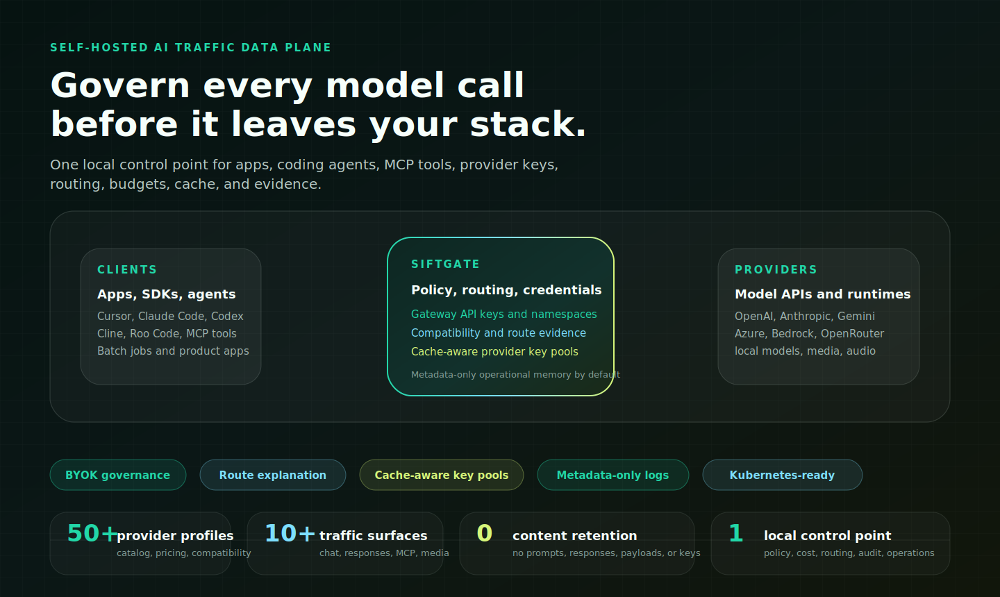
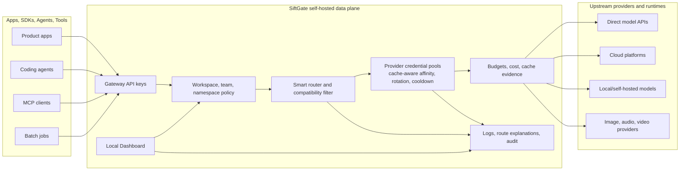
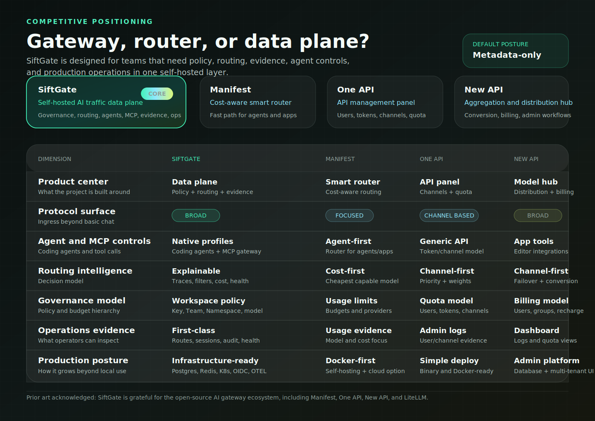
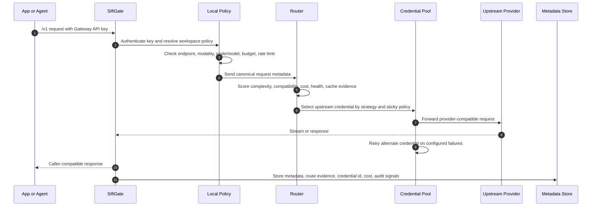

<p align="center">
  
</p>

<h3 align="center">The self-hosted AI traffic data plane for serious model traffic.</h3>

<p align="center">
  Govern apps, coding agents, MCP tools, provider keys, routing, budgets, cache, and evidence before requests leave your infrastructure.
</p>

<p align="center">
  <a href="https://github.com/seanbabalala/ai-gateway/releases/tag/v2.11.3"></a>
  <a href="LICENSE"></a>
  <a href="docs/SECURITY.md"></a>
  <a href="docs/README.md"></a>
</p>

<p align="center">
  <a href="docs/i18n/en/README.md">English</a>
  · <a href="docs/i18n/zh/README.md">简体中文</a>
  · <a href="docs/i18n/zh-TW/README.md">繁體中文</a>
  · <a href="docs/i18n/ja/README.md">日本語</a>
  · <a href="docs/i18n/ko/README.md">한국어</a>
  · <a href="docs/i18n/th/README.md">ไทย</a>
  · <a href="docs/i18n/es/README.md">Español</a>
</p>

# SiftGate

Current release: **v2.11.3**.

<p align="center">
  
</p>

SiftGate is an MIT open-source AI Gateway for teams that have outgrown direct
provider keys and single-purpose proxy panels. It gives organizations one
self-hosted control point for model traffic, coding-agent traffic, MCP tools,
provider credentials, credential-pool rotation, routing policy, cost
governance, cache savings, and operational evidence.

It sits between applications, agents, SDKs, tools, and upstream AI providers,
then answers the questions serious operators ask on every request:

| Operator question | SiftGate answer |
| --- | --- |
| Is this caller allowed to use this endpoint, model, modality, node, team budget, or namespace? | Gateway API keys, Workspaces, Teams, Policy Namespaces, endpoint/model/node restrictions, rate limits, and budget scopes. |
| Which model/provider should receive this request right now? | Compatibility filtering, tiered routing, model aliases, fallback chains, circuit state, cache-aware cost evidence, split rules, and route explanation. |
| Which upstream provider key should be used? | First-class `credentials[]` pools with least-in-flight, weighted round-robin, sticky affinity, cache-aware affinity, cooldown, and retryable-status failover. |
| What happened when the request ran? | Metadata-only call logs, route decision traces, credential-hit visibility, provider health, cache savings, cost estimates, session timelines, audit, and export-safe evidence. |
| What sensitive data is retained? | No prompt, response, raw header, provider key, tool payload, media, source, diff, hidden reasoning, or resolved secret storage by default. |

It supports OpenAI-compatible, Anthropic-compatible, Batch, Realtime preview,
media, embedding, rerank, and MCP tool traffic while keeping provider keys,
runtime policy, and sensitive operational metadata inside the self-hosted data
plane by default.

## The 30-Second Pitch

Most gateways stop at "route this request to a model." SiftGate goes further:
it turns AI traffic into a governed, explainable, production-grade control
loop.

<table>
  <tr>
    <td width="33%" valign="top">
      <strong>Traffic Control</strong><br>
      <sub>One ingress for Chat Completions, Responses, Anthropic Messages, Gemini-native calls, embeddings, rerank, media, Batch, Realtime preview, feedback, and MCP tool traffic.</sub>
    </td>
    <td width="33%" valign="top">
      <strong>Provider Power</strong><br>
      <sub>50+ provider metadata profiles, compatibility checks, provider health, model aliases, custom providers, secret references, and credential pools inside one logical node.</sub>
    </td>
    <td width="33%" valign="top">
      <strong>Operator Evidence</strong><br>
      <sub>Every route can explain selected and rejected candidates, policy filters, credential hits, cache effects, fallback reasons, cost estimates, latency, and audit context.</sub>
    </td>
  </tr>
  <tr>
    <td width="33%" valign="top">
      <strong>Agent Ready</strong><br>
      <sub>Govern Cursor, Cline, Roo Code, Continue, Codex, Claude Code, OpenCode, generic OpenAI/Anthropic agents, virtual smart models, and MCP tool calls.</sub>
    </td>
    <td width="33%" valign="top">
      <strong>Cost Discipline</strong><br>
      <sub>Daily budgets, team/key/namespace scopes, provider-cache savings, price-source governance, chargeback reports, anomaly evidence, and route feedback.</sub>
    </td>
    <td width="33%" valign="top">
      <strong>Self-Hosted Core</strong><br>
      <sub>SQLite local, PostgreSQL production, optional Redis shared state, Docker, Kubernetes, Helm, OIDC, OpenTelemetry, log sinks, and validation-first config rollout.</sub>
    </td>
  </tr>
</table>

## What Makes It Different

| SiftGate strength | Why it matters |
| --- | --- |
| **AI traffic data plane, not just a proxy** | Policy, routing, credential selection, budgets, cost, cache, audit, and evidence live in one local runtime path. |
| **First-class coding-agent gateway** | Agent tools get governed connector profiles and virtual smart models without giving every editor direct provider keys. |
| **Provider credential pools** | Multiple upstream keys can sit inside one logical node, with rotation, sticky affinity, cache-aware affinity, cooldown, retry, and credential-hit logs. |
| **Route explanation as a product surface** | Operators can see why SiftGate selected, skipped, retried, downgraded, or rejected a provider/model. |
| **Metadata-only by default** | The project is designed for operations without becoming a prompt, response, source-code, tool-payload, or provider-key store. |
| **Open-source production path** | The OSS data plane includes Dashboard, RBAC basics, Workspaces, policy scopes, audit, deployment manifests, docs, and validation gates. |

## Why SiftGate Exists

AI adoption usually starts with a few direct provider keys. It quickly becomes
a platform problem:

| Challenge | What SiftGate adds |
| --- | --- |
| Provider sprawl | One gateway for OpenAI, Anthropic, Google, Azure, Bedrock, OpenRouter, local runtimes, media providers, speech providers, and custom OpenAI-compatible endpoints. |
| Agent sprawl | Govern Cursor, Cline, Roo Code, Continue, Codex, Claude Code, OpenCode, chatbot clients, and MCP tool calls through one local ingress. |
| Fragmented provider quota | Pool multiple upstream credentials inside one provider node, rotate them by weighted round-robin or least-in-flight, keep agent sessions sticky, preserve provider cache locality, and cool down unhealthy keys before failing over. |
| Unclear routing | Explain why a node or model was selected, skipped, filtered, retried, or downgraded without storing prompt or response bodies by default. |
| Cost surprises | Enforce daily budgets, token and cost limits, provider-cache savings, price-source governance, chargeback reports, and anomaly evidence. |
| Key exposure | Keep provider API keys in local config, environment variables, or secret references; issue separate Gateway API keys to apps and agents. |
| Production readiness | Move from local memory and SQLite to PostgreSQL, Redis, Docker, Kubernetes, Helm, OIDC, log sinks, and secret backends when needed. |

## System At A Glance



The open-source data plane is complete on its own. A future or external control
plane is optional; AI requests do not need to pass through a hosted service.

## Capability Map

| Area | Capabilities |
| --- | --- |
| AI ingress | Chat Completions, Responses, Anthropic Messages, Embeddings, Rerank, Images, Audio, Video preview, Batch API, Realtime preview, Models, Feedback, and MCP Tool Gateway traffic. |
| Protocol translation | Canonical request model, protocol-aware normalizers and denormalizers, structured-output preservation, reasoning/thinking intent metadata, streaming support, multipart media pass-through, async job metadata. |
| Routing | `model: "auto"`, direct model routing, aliases, node shortcuts, model-family prefixes, tiered routing, fallback chains, split testing, compatibility-profile filtering, circuit breakers, momentum, load balancing, cache-aware cost routing. |
| Governance | Workspaces, local Dashboard RBAC, Gateway API keys, teams, Policy Namespaces, allowed endpoints, allowed modalities, allowed nodes, allowed models, per-key/team/namespace/global budgets, rate limits, audit events. |
| Provider operations | Provider Catalog, Add Node Wizard, 50+ provider metadata coverage, active vs transport-only visibility, pricing-source governance, custom provider templates, custom-header auth, provider credential pools with cache-aware affinity, least-in-flight or weighted rotation, sticky affinity, cooldown, retryable-status failover, per-credential observability, provider health dashboard, config validation. |
| Agent operations | Coding Agent Gateway profiles, profile-scoped virtual models, connector templates, metadata-only coding-agent sessions, Agent Platform preview, MCP server allow-lists and tool-call proxying. |
| Observability | Dashboard analytics, call logs, route decision traces, session timelines, provider health, benchmarks, cache savings, export-safe metadata, webhook alerts, optional log sinks, OpenTelemetry metrics/traces. |
| Cost and quality | Daily budget enforcement, estimated spend, provider-cache savings, chargeback reports, anomaly detection, route feedback, Intelligence Loop token prediction, optional cost optimizer, optional quality gate, async eval metadata. |
| Semantic controls | Semantic Cache v2, Prompt Registry metadata, Context Window Optimizer evidence, Intent Classification, Guardrails v2 metadata, workspace/API key/model isolation by default. |
| Deployment | Local development, Docker Compose, Docker image path, Kubernetes manifests, Helm chart, SQLite default, PostgreSQL production path, optional Redis shared state, OIDC, secret references. |

## Provider Credential Pools

Provider nodes can use a single `api_key` or a first-class `credentials` pool.
Pools rotate multiple upstream credentials inside the same node before the
router falls back to another node, which is useful when one provider account has
multiple approved keys for the same endpoint and model surface.

| Pool control | What it solves |
| --- | --- |
| Multiple `credentials[]` per node | Keep one logical provider/model node while spreading traffic across several upstream keys or accounts. |
| `cache_aware` | Keep requests that have created or read provider prompt cache on the same upstream key, reducing duplicated cache warmup across parallel coding-plan keys. |
| `least_in_flight` and `weighted_round_robin` | Prefer the least busy key for agent workloads, or use explicit weights for planned capacity distribution. |
| Sticky affinity | Keep a coding-agent session, API key, namespace, or model family on the same upstream credential when continuity matters. `cache_aware` falls back to stable API-key/team/session signals when agent sessions are missing. |
| Cooldown and retry status policy | Move away from keys that return 429/5xx/timeouts, then recover them after cooldown without operator intervention. |
| Credential-level log metadata | See which credential id handled a request, including retry count and strategy, while never exposing secret values. |

```yaml
nodes:
  - id: ada-coding-plan
    name: "ADA Coding Plan"
    protocol: messages
    base_url: "https://api.anthropic.com"
    endpoint: "/v1/messages"
    auth_type: x-api-key
    credentials:
      - id: primary
        api_key: "${env:ADA_CLAUDE_KEY_PRIMARY}"
        weight: 1
        enabled: true
      - id: backup
        api_key: "${env:ADA_CLAUDE_KEY_BACKUP}"
        weight: 1
        enabled: true
    credential_pool:
      enabled: true
      strategy: cache_aware
      sticky_by: agent_session
      cooldown_ms: 60000
      max_failures: 3
      retry_on_status: [429, 500, 502, 503, 504]
```

Credential ids are logged for operations, but secret values are never returned
by Dashboard APIs, call logs, route traces, telemetry, or log sinks.

## Competitive Matrix

SiftGate is not only a cheap model router and not only an API resale panel. It
is an AI traffic data plane: provider-compatible ingress, policy, routing,
budget control, agent governance, MCP controls, cache-aware credential pools,
route evidence, and production operations in one self-hosted system.

Public positioning references: [Manifest](https://github.com/mnfst/manifest),
[One API](https://github.com/songquanpeng/one-api), and
[New API](https://github.com/QuantumNous/new-api).

<p align="center">
  
</p>

<details>
<summary><strong>Open the text matrix</strong></summary>

<table>
  <thead>
    <tr>
      <th width="19%">Dimension</th>
      <th width="27%" align="center">SiftGate</th>
      <th width="18%" align="center">Manifest</th>
      <th width="18%" align="center">One API</th>
      <th width="18%" align="center">New API</th>
    </tr>
  </thead>
  <tbody>
    <tr>
      <td><strong>Product center</strong><br><sub>What the project is built around</sub></td>
      <td align="center"><strong>AI traffic data plane</strong><br><sub>Policy, routing, evidence, agents, MCP, production ops</sub></td>
      <td align="center"><strong>Smart router</strong><br><sub>Cost-aware model selection for agents and apps</sub></td>
      <td align="center"><strong>API manager</strong><br><sub>Users, tokens, channels, quota, redistribution</sub></td>
      <td align="center"><strong>Model hub</strong><br><sub>Aggregation, distribution, conversion, billing</sub></td>
    </tr>
    <tr>
      <td><strong>Best fit</strong><br><sub>The job it is strongest for</sub></td>
      <td align="center"><strong>Platform teams</strong><br><sub>BYOK governance across apps, agents, providers, budgets</sub></td>
      <td align="center"><strong>Agent builders</strong><br><sub>Fast path to cheaper capable models</sub></td>
      <td align="center"><strong>API distributors</strong><br><sub>Central token and channel administration</sub></td>
      <td align="center"><strong>Aggregation operators</strong><br><sub>UI, channels, billing, model distribution</sub></td>
    </tr>
    <tr>
      <td><strong>Protocol surface</strong><br><sub>Ingress beyond basic Chat</sub></td>
      <td align="center"><strong>Broad</strong><br><sub>Chat, Responses, Messages, Embeddings, Rerank, Images, Audio, Video preview, Batch, Realtime preview</sub></td>
      <td align="center"><strong>Focused</strong><br><sub>OpenAI-compatible routing first</sub></td>
      <td align="center"><strong>Channel dependent</strong><br><sub>Coverage follows configured providers and adapters</sub></td>
      <td align="center"><strong>Broad</strong><br><sub>Coverage depends on deployment, version, and provider</sub></td>
    </tr>
    <tr>
      <td><strong>Agent governance</strong><br><sub>Coding agents and tool calls</sub></td>
      <td align="center"><strong>Built in</strong><br><sub>Cursor, Cline, Roo Code, Continue, Codex, Claude Code, OpenCode, virtual smart models, MCP Tool Gateway</sub></td>
      <td align="center"><strong>Strong agent focus</strong><br><sub>Optimized for agent/app model routing</sub></td>
      <td align="center"><strong>Generic API layer</strong><br><sub>Token and channel model</sub></td>
      <td align="center"><strong>App integrations</strong><br><sub>Editor skills and token/model management</sub></td>
    </tr>
    <tr>
      <td><strong>Routing intelligence</strong><br><sub>How traffic decisions are made</sub></td>
      <td align="center"><strong>Explainable</strong><br><sub>Complexity scoring, compatibility profiles, cache-aware cost, circuits, fallbacks, split rules, route traces</sub></td>
      <td align="center"><strong>Cost-first</strong><br><sub>Cheapest capable model selection</sub></td>
      <td align="center"><strong>Channel-first</strong><br><sub>Priority, weight, load balancing</sub></td>
      <td align="center"><strong>Channel-first</strong><br><sub>Weighting, failover, protocol conversion</sub></td>
    </tr>
    <tr>
      <td><strong>Governance model</strong><br><sub>Policy and budget hierarchy</sub></td>
      <td align="center"><strong>Team-owned policy</strong><br><sub>Workspace, API key, Team, Policy Namespace, endpoint, modality, node, model, global/team/key budgets</sub></td>
      <td align="center"><strong>Usage controls</strong><br><sub>Budgets, limits, providers, agents</sub></td>
      <td align="center"><strong>Quota controls</strong><br><sub>Users, tokens, channels, quotas</sub></td>
      <td align="center"><strong>Billing controls</strong><br><sub>Users, groups, tokens, channels, quota, recharge/subscription workflows</sub></td>
    </tr>
    <tr>
      <td><strong>Provider credential pools</strong><br><sub>Multiple upstream keys inside one logical node</sub></td>
      <td align="center"><strong>First-class</strong><br><sub><code>credentials[]</code>, cache-aware affinity, least-in-flight, weighted rotation, sticky affinity, cooldown, retryable-status failover, credential-hit logs</sub></td>
      <td align="center"><strong>Not the center</strong><br><sub>Provider credentials support routing, but pool operations are not the main product surface</sub></td>
      <td align="center"><strong>Channel based</strong><br><sub>Capacity is usually modeled through channels and tokens rather than per-node credential pools</sub></td>
      <td align="center"><strong>Channel based</strong><br><sub>Capacity and failover are commonly managed through channel/provider configuration</sub></td>
    </tr>
    <tr>
      <td><strong>Operations evidence</strong><br><sub>What operators can inspect</sub></td>
      <td align="center"><strong>First-class</strong><br><sub>Route Explanation, credential-hit logs, sessions, audit, provider health, cost platform, semantic controls, config rollback</sub></td>
      <td align="center"><strong>Model/cost focused</strong><br><sub>Routing and usage evidence</sub></td>
      <td align="center"><strong>Admin focused</strong><br><sub>Channel, user, quota, log evidence</sub></td>
      <td align="center"><strong>Admin focused</strong><br><sub>Dashboard, logs, quota, channel evidence</sub></td>
    </tr>
    <tr>
      <td><strong>Privacy default</strong><br><sub>Content retention posture</sub></td>
      <td align="center"><strong>Metadata-only by default</strong><br><sub>No prompt, response, raw header, provider key, tool payload, media, source, diff, hidden reasoning, or resolved secret storage by default</sub></td>
      <td align="center"><strong>Metadata-first</strong><br><sub>Public docs state prompts and responses are not stored by default</sub></td>
      <td align="center"><strong>Operator dependent</strong><br><sub>Depends on deployment and retention choices</sub></td>
      <td align="center"><strong>Operator dependent</strong><br><sub>Depends on deployment and retention choices</sub></td>
    </tr>
    <tr>
      <td><strong>Production path</strong><br><sub>How it grows past local use</sub></td>
      <td align="center"><strong>Infrastructure-ready</strong><br><sub>SQLite local, PostgreSQL production, optional Redis, Docker, Kubernetes, Helm, OIDC, secret references, log sinks, OpenTelemetry</sub></td>
      <td align="center"><strong>Docker-first</strong><br><sub>Self-hosting plus cloud option</sub></td>
      <td align="center"><strong>Simple deploy</strong><br><sub>Single binary and Docker-ready</sub></td>
      <td align="center"><strong>Admin platform</strong><br><sub>Docker, database options, admin UI, multi-tenant operations</sub></td>
    </tr>
  </tbody>
</table>

</details>

### Prior Art And Acknowledgements

SiftGate is built in conversation with a broader open-source AI gateway
ecosystem. Manifest helped make cost-aware intelligent model routing for agents
and applications feel practical. One API and New API made multi-provider API
aggregation, channel management, quota workflows, and self-hosted admin
operations accessible to many operators.

SiftGate takes a different path: a self-hosted AI traffic data plane focused on
BYOK governance, explainable routing, agent and MCP controls, privacy-safe
metadata, and production operations. We are grateful for the public work these
projects contributed to the ecosystem.

Read the fuller comparison in [docs/COMPARISON.md](docs/COMPARISON.md).

## Request Flow



By default, SiftGate stores operational metadata such as request ids, selected
node/model, credential id, credential retry count, latency, status, token
usage, cost estimate, policy labels, fallback reason, cache evidence, and route
explanation. It does **not** store
prompts, responses, raw provider headers, provider keys, tool payloads, media
bytes, hidden reasoning text, or resolved secrets unless a specific feature is
explicitly configured to retain content.

## Gateway API Surface

SiftGate exposes provider-compatible endpoints so existing clients can move
behind the gateway with minimal changes.

| Endpoint | Purpose |
| --- | --- |
| `POST /v1/chat/completions` | OpenAI Chat Completions-compatible ingress |
| `POST /v1/responses` | OpenAI Responses-compatible ingress |
| `POST /v1/messages` | Anthropic Messages-compatible ingress |
| `POST /v1/embeddings` | Embedding routing |
| `POST /v1/rerank` | Rerank routing |
| `POST /v1/images/generations` | Image generation |
| `POST /v1/images/edits` | Image edits with JSON or multipart pass-through |
| `POST /v1/images/variations` | Image variations |
| `POST /v1/audio/transcriptions` | Audio transcription |
| `POST /v1/audio/translations` | Audio translation |
| `POST /v1/audio/speech` | Text-to-speech |
| `POST /v1/videos/generations` | Experimental async video generation preview |
| `POST /v1/batches` | OpenAI-compatible Batch API proxy |
| `WS /v1/realtime` | Experimental Realtime pass-through, disabled by default |
| `GET /v1/models` | OpenAI-compatible model list and gateway aliases |
| `POST /v1/feedback` | Metadata-only route feedback |

Interactive OpenAPI documentation is available at `GET /docs` when the gateway
is running.

## Dashboard Surfaces

The Dashboard runs from the same gateway process and is part of the open-source
data plane.

| Page | What operators use it for |
| --- | --- |
| Overview | First-run setup, live traffic, cost, cache savings, provider health, recent activity, and Intelligence Loop summary. |
| Nodes | Configure upstream provider nodes and credential pools, run safe checks, inspect health, circuits, compatibility, and pricing warnings. |
| Provider Catalog | Explore provider/model metadata, recommended defaults, modality coverage, compatibility profiles, and pricing source status. |
| Routing | Edit tiers, targets, fallback chains, load balancing, split rules, and recommendations. |
| Route Explanation | Inspect selected and rejected candidates, policy filters, cost/latency/context tradeoffs, compatibility evidence, and fallback reasons. |
| Logs and Sessions | Review request metadata, source format, route result, credential hit, cache outcome, structured-output and reasoning intent, agent sessions, and export-safe details. |
| API Keys | Create, rotate, disable, scope, and audit client-facing Gateway API keys. |
| Workspaces and Members | Manage local Workspaces, fixed OSS roles, membership, and invitations. |
| Policy Namespaces and Budget | Configure shared policy labels, source-of-truth budget scopes, limits, and resets. |
| Agents | Render safe connector profiles for coding agents and inspect metadata-only agent sessions. |
| MCP Tool Gateway | Proxy HTTP JSON-RPC, Streamable HTTP, legacy SSE, and stdio MCP calls behind Gateway API key auth and namespace allow-lists. |
| Semantic Controls | Operate semantic cache metadata, prompt registry metadata, intent counts, context evidence, and guardrails findings. |
| Cost Platform | Review chargeback reports, anomalies, provider price governance, and feedback aggregation. |
| Eval, Shadow, Experiments | Keep eval reports, shadow traffic, and A/B split analytics separate and inspectable. |
| Audit and Config Audit | Review redacted management events, config versions, validation-first rollback, and hash-chain evidence. |

## Provider And Model Ecosystem

SiftGate is designed for heterogeneous provider environments. The built-in
catalog includes direct model APIs, China providers, aggregators, cloud
platforms, media providers, speech/audio providers, local runtimes, and
OpenAI-compatible hosted inference providers.

| Family | Examples |
| --- | --- |
| Direct model APIs | OpenAI, Anthropic, Google Gemini / Vertex, Mistral, DeepSeek, xAI, Cohere, AI21 Labs |
| China providers | Qwen / DashScope, Baidu Qianfan, Volcengine Ark / Doubao, Zhipu GLM, Moonshot / Kimi, MiniMax, Tencent Hunyuan, 01.AI |
| Aggregators | OpenRouter, Hugging Face Inference Providers, Replicate, Together AI, Fireworks AI, NVIDIA NIM, GitHub Models |
| Cloud platforms | AWS Bedrock, Azure OpenAI, Cloudflare Workers AI, IBM watsonx.ai, Databricks Mosaic AI |
| Media generation | fal.ai, Stability AI, Black Forest Labs, Ideogram, Luma AI, Runway, Pika |
| Speech, audio, embedding, rerank | ElevenLabs, Deepgram, AssemblyAI, Cartesia, Speechmatics, Voyage AI, Jina AI |
| Local and self-hosted | Ollama, vLLM, LM Studio, llama.cpp server, TGI, SGLang, Xinference, Baseten, Lepton AI, Modal, RunPod, Predibase, Lamini |
| Hosted compatible inference | DeepInfra, Nebius AI Studio, Novita AI, FriendliAI |

Catalog data is operational guidance, not a billing authority. Explicit local
node pricing, `models_pricing`, and `catalog.override.yaml` always remain the
operator-controlled source of truth.

## Agent And Tool Gateway

SiftGate can act as the governed ingress for developer tools and autonomous
agents without becoming a workflow engine or content store.

| Surface | What it does |
| --- | --- |
| Coding Agent Gateway | Creates connector profiles for Cursor, Cline, Roo Code, Continue, Codex, Claude Code, OpenCode, Generic OpenAI-compatible agents, and Generic Anthropic-compatible agents. |
| Virtual smart models | Exposes profile-scoped aliases such as `coding-auto`, `coding-fast`, `coding-deep`, and `coding-security`, which map to internal smart routing while respecting policy. |
| Agent session tracing | Stores metadata such as connector, repo label, project label, session id, selected route, cost, latency, fallback, and trace links. It does not store source files, diffs, prompts, or responses by default. |
| MCP Tool Gateway | Proxies configured HTTP JSON-RPC, Streamable HTTP, legacy SSE, and stdio MCP servers behind Gateway API key auth, Policy Namespace allow-lists, rate limits, and metadata-only call logs. |
| Agent Platform preview | Shows read-only A2A registry rows, tool registry metadata, workflow metadata, memory counters, and recent trace spans. |

## Security And Privacy Baseline

SiftGate is built around local control:

- Provider API keys are not client credentials. They stay in local config,
  environment variables, or secret references and are only used by the gateway.
- Provider credential pools expose operator-defined credential ids and runtime
  status only. Secret values are redacted from Dashboard APIs, logs, route
  traces, telemetry, exports, and log sinks.
- Gateway API keys are shown in full only once on create or rotate. Lists and
  detail views expose masked prefixes and policy metadata.
- Dashboard authentication is enabled by default. Local password bootstrap,
  bcrypt storage, optional generic OIDC, local RBAC, and workspace invitations
  are included in the OSS data plane.
- Management audit events and config audit records use redacted summaries.
- Metadata-only defaults apply across logs, route decisions, sessions,
  benchmarks, eval reports, guardrails findings, semantic controls, MCP calls,
  batch jobs, video jobs, and provider health evidence.
- Features that can retain replayable responses or samples require explicit
  configuration and should be reviewed against local policy.

## What It Is Not

SiftGate is not an API resale platform, billing wallet, hosted prompt store,
workflow engine, model marketplace, or mandatory SaaS control plane. It does
not require customers to send AI requests through SiftGate Cloud. It does not
turn third-party catalog prices into billing truth. It does not store prompts,
responses, provider keys, raw headers, media bytes, MCP tool payloads, source
code, diffs, hidden reasoning text, or resolved secrets by default.

## Quick Start

```bash
git clone https://github.com/seanbabalala/ai-gateway.git
cd ai-gateway
npm install
cd frontend && npm install && cd ..
cp gateway.config.example.yaml gateway.config.yaml
cp .env.example .env
npm run build
npm start
```

SiftGate loads `.env` automatically for local startup. The example provider
nodes use runtime secret references such as `${env:OPENAI_API_KEY}`, so the
Dashboard can start before provider keys are filled in.

On first startup, SiftGate generates an initial Dashboard password, logs it
once, and stores only its bcrypt hash in `gateway.config.yaml`.

Open:

| Surface | URL |
| --- | --- |
| Dashboard | `http://localhost:2099/dashboard` |
| OpenAPI | `http://localhost:2099/docs` |
| Gateway | `http://localhost:2099` |

Add or verify one upstream node in `gateway.config.yaml`, create a
Dashboard-managed Gateway API key, then send a request:

```bash
curl http://localhost:2099/v1/chat/completions \
  -H "content-type: application/json" \
  -H "authorization: Bearer ${SIFTGATE_API_KEY}" \
  -d '{
    "model": "auto",
    "messages": [{"role": "user", "content": "Explain SiftGate in one sentence."}]
  }'
```

For a container-first path, use [Docker Quickstart](docs/DOCKER_QUICKSTART.md).

## First-Run Operator Path

1. Confirm or create the active Workspace.
2. Add one Provider Node from the Dashboard or config.
3. Create a Dashboard-managed Gateway API Key.
4. Optionally bind the key to a Policy Namespace or Team.
5. Review daily Budget scope and source of truth.
6. Send a first request from Playground or an SDK.
7. Inspect Logs and Route Explanation evidence.
8. Configure Semantic Controls, Traffic Experiments, Evals, Shadow Traffic, or
   MCP Tool Gateway only when you need those advanced surfaces.

## Deployment Path

| Stage | Recommended setup |
| --- | --- |
| Local evaluation | Node.js process, memory state, SQLite, local password bootstrap, example config. |
| Team self-hosting | Docker or Docker Compose, SQLite or PostgreSQL, Dashboard API keys, Policy Namespaces, audit, provider health, log retention. |
| Production | PostgreSQL, optional Redis shared state, OIDC, secret references, log sinks, OpenTelemetry, Kubernetes or Helm, config validation, docs release checks. |
| Multi-instance | Load balancer, shared PostgreSQL, Redis-backed rate limits/circuit state/cache/momentum where needed, health checks, controlled config rollout. |

## Documentation

Start here:

| Topic | Link |
| --- | --- |
| Documentation Home | [docs/README.md](docs/README.md) |
| Quickstart | [docs/QUICKSTART.md](docs/QUICKSTART.md) |
| Docker Quickstart | [docs/DOCKER_QUICKSTART.md](docs/DOCKER_QUICKSTART.md) |
| Dashboard Guide | [docs/DASHBOARD.md](docs/DASHBOARD.md) |
| Comparison | [docs/COMPARISON.md](docs/COMPARISON.md) |
| API Reference | [docs/API_REFERENCE.md](docs/API_REFERENCE.md) |
| Architecture | [docs/ARCHITECTURE.md](docs/ARCHITECTURE.md) |
| Provider Catalog | [docs/PROVIDER_CATALOG.md](docs/PROVIDER_CATALOG.md) |
| Coding Agent Gateway | [docs/CODING_AGENT_GATEWAY.md](docs/CODING_AGENT_GATEWAY.md) |
| MCP Tool Gateway | [docs/MCP_GATEWAY.md](docs/MCP_GATEWAY.md) |
| Semantic Controls | [docs/SEMANTIC_PLATFORM.md](docs/SEMANTIC_PLATFORM.md) |
| Cost Platform | [docs/COST_CHARGEBACK_PLATFORM.md](docs/COST_CHARGEBACK_PLATFORM.md) |
| Production Guide | [docs/PRODUCTION.md](docs/PRODUCTION.md) |
| Security | [docs/SECURITY.md](docs/SECURITY.md) |

Localized documentation entrypoints:

| Language | Link |
| --- | --- |
| English | [docs/i18n/en/README.md](docs/i18n/en/README.md) |
| 简体中文 | [docs/i18n/zh/README.md](docs/i18n/zh/README.md) |
| 繁體中文 | [docs/i18n/zh-TW/README.md](docs/i18n/zh-TW/README.md) |
| 日本語 | [docs/i18n/ja/README.md](docs/i18n/ja/README.md) |
| 한국어 | [docs/i18n/ko/README.md](docs/i18n/ko/README.md) |
| ไทย | [docs/i18n/th/README.md](docs/i18n/th/README.md) |
| Español | [docs/i18n/es/README.md](docs/i18n/es/README.md) |

## Public Repository Hygiene

The public repository tracks source, examples, docs, tests, and deployment
manifests only. It intentionally ignores local runtime config, local databases,
catalog sync cache, local agent notes, and private development prompts.

Before opening a PR, run:

```bash
npm run docs:check
npm run build
cd frontend && npm test && npm run build
```

Release branches should also run the broader test matrix listed in
[Release Checklist](docs/RELEASE_CHECKLIST.md).

## Community

| Resource | Link |
| --- | --- |
| Contributing | [CONTRIBUTING.md](CONTRIBUTING.md) |
| Security policy | [SECURITY.md](SECURITY.md) |
| Code of conduct | [CODE_OF_CONDUCT.md](CODE_OF_CONDUCT.md) |
| Changelog | [CHANGELOG.md](CHANGELOG.md) |
| License | [MIT](LICENSE) |
