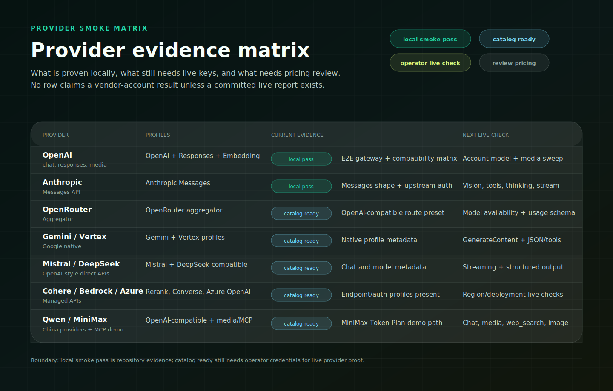
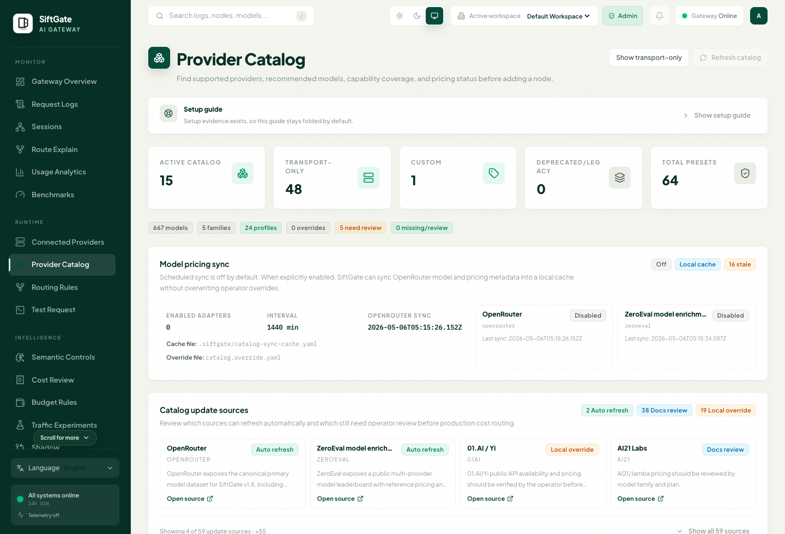

# Provider Smoke Matrix

This matrix records what SiftGate can prove from the public repository today:
catalog coverage, compatibility-profile mapping, local protocol smoke tests,
and the live-provider checks operators should run with their own keys.

It is intentionally conservative. A row marked `local smoke pass` means the
repo has automated mock-upstream or compatibility-matrix coverage for the
protocol path. It does not mean SiftGate has committed a live call against a
vendor account. A row marked `catalog ready` means the Provider Catalog has the
provider preset, endpoint/auth shape, model buckets, and compatibility profile
needed for an operator-run check.



The Dashboard surfaces the same evidence for operators before they add a live
node: active catalog rows, transport-only presets, compatibility profiles,
pricing review state, and catalog sync governance are visible in the Provider
Catalog page.



## Status Legend

| Status | Meaning |
| --- | --- |
| `local smoke pass` | Automated tests exercise the SiftGate gateway path with local mocks or safe compatibility probes. |
| `catalog ready` | Provider preset, endpoint/auth metadata, model buckets, and compatibility profile are present; live check still needs operator credentials. |
| `operator live check` | Requires a real provider key, deployment, account region, or billing context. No live result is committed. |
| `review pricing` | Built-in pricing is a reference snapshot or provider-docs placeholder; production budgets should use local overrides. |

## Current Matrix

| Provider / Target | Catalog Id | Compatibility Profile | Current Evidence | Next Live Check |
| --- | --- | --- | --- | --- |
| OpenAI | `openai` | `openai_compatible`, `openai_responses_compatible`, `embedding_compatible`, media/audio profiles | Local e2e covers Chat Completions, Responses routing, Embeddings, Images, Realtime endpoint/auth checks, and metadata-only Dashboard compatibility matrix. | Run chat, responses, embeddings, image generation/edit, audio, realtime, and batch with account-scoped models. |
| Anthropic | `anthropic` | `anthropic_messages_compatible` | Local e2e covers Messages ingress, Anthropic-style response shape, `x-api-key` upstream auth, and streaming Messages behavior. | Run Messages, vision input, tool use, and thinking/streaming against account-enabled Claude models. |
| OpenAI-compatible custom / local | `openai-compatible`, `vllm`, `ollama` | `openai_compatible`, `local_vllm`, `local_ollama` | Local e2e covers OpenAI-compatible request/response handling and route evidence with mock upstreams. | Run against the operator's local server and verify model list, streaming, embeddings, and structured output behavior. |
| OpenRouter | `openrouter` | `openrouter_aggregator` | Catalog-ready aggregator preset with OpenAI-compatible chat route and operator-required pricing boundary. | Run chat/vision models, provider routing headers, usage schema, and model availability for the operator account. |
| Google Gemini | `google-gemini` | `google_gemini_compatible`, `google_gemini_openai_compatible` | Catalog-ready native Gemini and OpenAI-compatible profile metadata. | Run GenerateContent, streaming, JSON output, tools, thinking config, and Google Search grounding where enabled. |
| Azure OpenAI | `azure-openai` | `azure_openai_compatible` | Catalog-ready Azure OpenAI deployment shape with operator-local pricing boundary. | Run against the operator deployment name, API version, region, and private model aliases. |
| AWS Bedrock | `aws-bedrock` | `aws_bedrock_converse` | Catalog-ready Bedrock Converse/invoke shapes with SigV4/operator-region boundary. | Run Converse, embeddings, image invoke, inference profiles, and regional auth with AWS credentials. |
| Mistral AI | `mistral` | `mistral_compatible`, `embedding_compatible` | Catalog-ready OpenAI-style chat and embeddings metadata. | Run chat, streaming, embeddings, and structured-output behavior for enabled models. |
| DeepSeek | `deepseek` | `deepseek_compatible` | Catalog-ready OpenAI-compatible chat metadata. | Run chat, reasoning model behavior, streaming, and usage accounting with the operator key. |
| Cohere | `cohere` | `cohere_compatible`, `embedding_compatible`, `rerank_compatible` | Catalog-ready chat, embeddings, and rerank metadata. | Run chat, embed, rerank, usage mapping, and rate-limit behavior. |
| Alibaba Qwen / DashScope | `alibaba-qwen` | `openai_compatible` plus provider-specific catalog metadata | Catalog-ready China-region provider preset. | Run OpenAI-compatible chat, model aliases, streaming, and region/account-specific endpoints. |
| MiniMax | `minimax` | `openai_compatible`, media/audio profiles, MCP tool proxy config | Catalog-ready text/audio/image/video metadata plus documented MiniMax Token Plan MCP `web_search` and `understand_image` demo path. | Run chat, audio, image/video endpoint/auth checks, and MCP stdio tools with `MINIMAX_TOKEN_PLAN_KEY`. |

## Operator Live-Check Template

Use this template when adding a committed or release-note live result:

```markdown
| Provider | Date | SiftGate Commit | Endpoint | Model | Mode | Result | Notes |
| --- | --- | --- | --- | --- | --- | --- | --- |
| OpenAI | 2026-05-15 | `<commit>` | `/v1/chat/completions` | `gpt-4o-mini` | non-stream | pass | Account region, request body, and usage fields reviewed. |
```

Live-check notes should include request body shape, stream/non-stream mode,
model id, account region or deployment name when relevant, SiftGate commit,
Gateway API key policy, provider node config, and whether pricing was local
override or reference-only.

## Privacy Boundary

Smoke reports and compatibility rows should store metadata only: provider id,
endpoint family, model id, status, latency, sanitized error type, source
format, and compatibility profile. They should not store prompts, responses,
raw auth headers, provider keys, resolved secrets, media bytes, tool payloads,
or live account identifiers.
