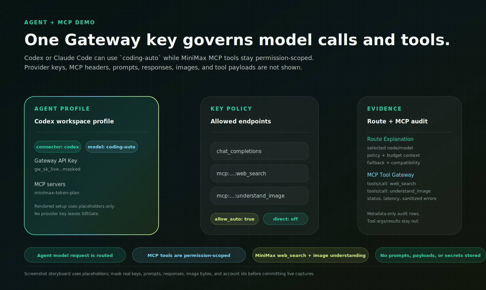

# SiftGate ドキュメント

[ドキュメントホーム](../../README.md) · [プロジェクト README](../../../README.md)

現在のリリース: **v2.11.3**。

SiftGate は、直接配布されたプロバイダーキー、場当たり的なプロキシ設定、
不透明なモデルルーティングを卒業したチームのためのセルフホスト型 AI traffic
data plane です。アプリ、Coding Agent、MCP ツール、プロバイダー認証情報、
ルーティングポリシー、予算、キャッシュ証跡、本番運用を 1 つのローカル制御面にまとめます。

<p align="center">
  
</p>

## 最新の製品メッセージ

| SiftGate の強み | なぜ重要か |
| --- | --- |
| AI traffic data plane | ポリシー、ルーティング、認証情報選択、予算、コスト、キャッシュ、監査、証跡を 1 つのセルフホスト request path で扱います。 |
| Agent と MCP のガバナンス | Cursor、Cline、Roo Code、Continue、Codex、Claude Code、OpenCode、汎用 OpenAI/Anthropic Agent、HTTP JSON-RPC、Streamable HTTP、legacy SSE、stdio MCP ツールを 1 つの管理された入口に集約できます。 |
| キャッシュ認識 credential pool | 1 つの Provider Node に複数の upstream key を置き、`cache_aware`、least-in-flight、weighted rotation、sticky affinity、cooldown、retry failover を使えます。 |
| Route Explanation | prompt/response を既定保存せずに、モデルやノードが選択、除外、再試行、降格、拒否された理由を確認できます。 |
| metadata-only by default | 既定では prompt、response、raw header、provider key、tool payload、media bytes、source、diff、hidden reasoning、resolved secret を保存しません。 |
| 本番運用への道筋 | SQLite と memory state から始め、PostgreSQL、Redis、Docker、Kubernetes、Helm、OIDC、secret references、log sinks、OpenTelemetry に拡張できます。 |

## 30 秒で理解する SiftGate

多くのゲートウェイは「このリクエストをどのモデルへ送るか」で止まります。
SiftGate は AI トラフィックを、ガバナンス可能で説明可能な制御ループにします。

1. Gateway API Key を認証し、Workspace、Team、Policy Namespace を解決します。
2. endpoint、modality、model、node、budget、rate limit の権限を確認します。
3. 互換性、コスト、レイテンシ、ヘルス、キャッシュ証跡、fallback ルールでルーティングします。
4. キャッシュ認識 affinity を含め、適切な upstream provider credential を選択します。
5. provider-compatible response を返し、export-safe な運用証跡を保存します。

## Provider Credential Pools

Provider Node は単一の `api_key` だけでなく、第一級の `credentials[]` pool を
使えます。pool は同じ論理ノード内で upstream key を rotation/retry し、その後に
node-level fallback へ進みます。

```yaml
credential_pool:
  enabled: true
  strategy: cache_aware
  sticky_by: agent_session
  cooldown_ms: 60000
  max_failures: 3
  retry_on_status: [429, 500, 502, 503, 504]
```

同じ provider/account/model surface に複数の key を持つ coding plan や Agent
workload では、`cache_aware` が有効です。SiftGate は provider prompt cache を
作成または読み取った traffic を可能な限り同じ upstream key に維持し、429/5xx/timeout
では別 key に切り替えます。

## 競合との位置づけ

SiftGate は安価なモデルルーターだけでも、API 再販パネルだけでもありません。
BYOK ガバナンス、route evidence、Agent/MCP control、cache-aware key pool、
production operations のためのセルフホスト型 AI traffic data plane です。

<p align="center">
  
</p>

詳細は [Comparison](../../COMPARISON.md) を参照してください。

## 証拠アセット

Provider smoke evidence は、ローカルのプロトコルテストと、運用者の実 Key が
必要な live provider check を分けて示します。詳しくは
[Provider Smoke Matrix](../../PROVIDER_SMOKE_MATRIX.md) を参照してください。

<p align="center">
  
</p>

Provider Catalog Dashboard では active catalog、transport-only preset、
compatibility profiles、pricing review state、catalog sync governance を確認できます。

<p align="center">
  
</p>

Codex/Claude Code + MiniMax MCP の流れは
[Agent + MCP Demo](../../AGENT_MCP_DEMO.md) を参照してください。

<p align="center">
  
</p>

## クイックスタート

```bash
git clone https://github.com/seanbabalala/ai-gateway.git
cd ai-gateway
npm install
cd frontend && npm install && cd ..
cp gateway.config.example.yaml gateway.config.yaml
cp .env.example .env
npm run build
npm start
```

`http://localhost:2099/dashboard` を開き、Provider Node を追加し、Gateway API Key
を作成して、`http://localhost:2099/v1/chat/completions` にリクエストを送ります。

## 初回セットアップ

1. 現在の Workspace を確認または作成します。
2. Provider Node を 1 つ追加します。
3. Dashboard 管理の Gateway API Key を作成します。
4. 必要に応じて Policy Namespace または Team に紐付けます。
5. 日次 Budget の scope と source of truth を確認します。
6. Playground、SDK、または OpenAI-compatible client から最初のリクエストを送信します。
7. Logs、Sessions、Route Explanation を確認します。
8. 必要な場合だけ Semantic Controls、Traffic Experiments、Evals、Shadow Traffic、MCP Tool Gateway を設定します。

## ドキュメントマップ

| 領域 | 入口 |
| --- | --- |
| ローカル評価と Dashboard | [Quickstart](../../QUICKSTART.md), [Dashboard](../../DASHBOARD.md), [OSS Concepts](../../OSS_CONCEPTS.md), [Playground](../../PLAYGROUND.md) |
| 本番運用 | [Docker Quickstart](../../DOCKER_QUICKSTART.md), [Production](../../PRODUCTION.md), [Kubernetes and Helm](../../KUBERNETES.md), [State Backends](../../STATE_BACKEND.md), [Secret Management](../../SECRET_MANAGEMENT.md), [Config Validation](../../CONFIG_VALIDATION.md), [Config Audit and Rollback](../../CONFIG_AUDIT_ROLLBACK.md) |
| プロバイダーとプロトコル | [Provider Catalog](../../PROVIDER_CATALOG.md), [Adding Providers](../../ADDING_PROVIDERS.md), [Provider Compatibility](../../PROVIDER_COMPATIBILITY.md), [Provider Extensibility](../../PROVIDER_EXTENSIBILITY.md), [Multimodal Capabilities](../../MULTIMODAL_CAPABILITIES.md), [Batch API](../../BATCH_API.md) |
| ルーティングとガバナンス | [Routing Recommendations](../../ROUTING_RECOMMENDATIONS.md), [Policy Namespaces and Shadow Traffic](../../NAMESPACES_AND_SHADOW.md), [Cost Platform](../../COST_CHARGEBACK_PLATFORM.md), [Billing Loop](../../BILLING_LOOP.md) |
| Agent と MCP traffic | [Coding Agent Gateway](../../CODING_AGENT_GATEWAY.md), [Agent Gateway Profiles](../../AGENT_GATEWAY.md), [Agent Integrations](../../AGENT_INTEGRATIONS.md), [Agent Platform Preview](../../AGENT_PLATFORM_PREVIEW.md), [MCP Tool Gateway](../../MCP_GATEWAY.md) |
| 高度な制御と証跡 | [Semantic Controls](../../SEMANTIC_PLATFORM.md), [Caching](../../CACHING.md), [Stream, Cache, and Batching](../../STREAM_CACHE_BATCHING.md), [Intelligence Loop](../../INTELLIGENCE_LOOP.md), [Evaluation Framework](../../EVALUATION_FRAMEWORK.md), [Performance](../../PERFORMANCE.md) |
| 可観測性と control plane | [Webhook Alerts](../../WEBHOOK_ALERTS.md), [Log Sinks](../../LOG_SINKS.md), [Control Plane Contract](../../CONTROL_PLANE.md), [Security](../../SECURITY.md) |
| 開発と移行 | [Architecture](../../ARCHITECTURE.md), [API Reference](../../API_REFERENCE.md), [SDKs](../../SDKS.md), [Plugins](../../PLUGINS.md), [Migration Compatibility](../../MIGRATION_COMPAT.md), [Release Checklist](../../RELEASE_CHECKLIST.md) |
